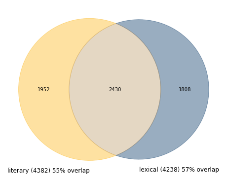
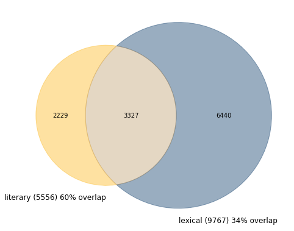
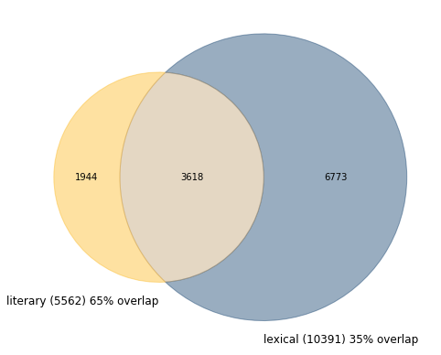

[TOC]

# 3. Lexical and Literary Vocabularies

In the Old Babylonian period (around 1,800 BCE) scribal students learned how to read and write by copying longs lists of signs and words (lexical lists). In a second stage they would start copying a broad variety of Sumerian literary texts, including hymns to gods and kings, narrative texts about gods and heroes of the past, and whimsical texts in which non-human entities (such as hoe and plow) dispute their utility for mankind.

Sumerian by this time was a dead language and the whole curriculum has been interpreted as an "invented tradition" - a golden age, projected in the distant past, when all of Babylonia was united under a single king, speaking a single language - Sumerian[^1].

The sequence lexical exercises - literary exercises may suggest that the literary material embodies the real goal of this education and that the lexical texts, enumerating thousands of Sumerian words and expressions, function in support of the students' ability to read, copy, and understand the literary compositions. Yet, it has often been noticed that many words and expressions in the lexical repertoire never appear in literary texts - and the other way around. In the [list of domestic animals](http://oracc.org/dcclt/Q000001), for instance, we find the entry **udu gug-ga-na₂** (sheep for a *guqqanû* offering; line 98). The expression is known from administrative texts in the Ur III period, several centuries earlier (see, for instance, [TLB 03, 095](http://oracc.org/epsd2/admin/u3adm/P134236) o 9), but in the literary corpus the word **gug-ga-na₂** is absent. Many other such examples could be quoted here.

One may draw the conclusion that the "invented tradition" that was the subject of this curriculum not only involved the literary corpus, but also the Sumerian language itself. The lexical corpus not only functioned in support of the literary corpus - it also had a function of its own in preserving as much as possible of Sumerian writing and vocabulary.

Research on bird vocabulary showed that of the 116 entries in the Old Babylonian [list of birds](http://oracc.org/dcclt/Q000041.405), only 39 can be found in the literary corpus.[^2] This research was mainly done by hand, based on the author's reconstruction of the Old Babylonian bird list and a survey of Sumerian literature - primarily based on the Electronic Text Corpus of Sumerian Literature ([ETCSL][]; more on [ETCSL][] below). The challenge of this chapter is: can we scale this analysis up, to include the entire Old Babylonian lexical and literary corpus by using computational methods? And is it possible to use such methods to dig deeper into the relationship between these two vocabularies?

## 3.1 A First Attempt

As a first attempt, we may simply take all Old Babylonian lexical lists from [DCCLT][], extract the full vocabulary and compare that vocabulary to the inventory of words (lemmas) in [ETCSL][]. In this approach we are not concerned with word frequencies - the issue simply is: is this particular word (lemma) attested in literary texts (in [ETCSL][]), in (Old Babylonian) lexical texts, or in both.

In order to do so we read the  [ETCSL][] and the [DCCLT][] datasets into Pandas DataFrames. The first step is to create a field `lemma` by adding Citation Form, Guide Word, and Part of Speech in the format **du[build]V/t**, or **lugal[king]N**. Next, we restrict the [DCCLT][] dataset to only Old Babylonian documents. We read the `catalogue.json` file from the `dcclt.zip` and isolate the text ID numbers that have the value "Old Babylonian" in the field `period`.  From both datasets we eliminate words that are not in Sumerian (e.g. Akkadian glosses). Finally we extract the new `lemma` field from both datasets and reduce them to their unique elements with the `set()` function: a `set` in Python is an unordered list of unique elements. 

From the two sets, which we call `etcsl_words_s` and `lexical_words_s` we eliminate all words that have not been lemmatized (unknown words or broken words). We will see in the next section that we will need unlemmatized words in a slightly more sophisticated analysis - but not here. Collections of unique elements can be visualized in a Venn diagram, that shows the two sets as two partly overlapping circles. The intersection of the two sets represents the overlap. This is done with the function `venn2` from the `matplotlib_venn` package, which allows us to select colors and define captions. The result looks like this:



The Old Babylonian lexical corpus currently has 4,165 distinct lemmas, of which 2,033 (or almost half) are shared with the literary corpus. The vocabulary of the literary corpus is only slightly larger with 4,345 distinct lemmas.

For a number of reasons, this is a very rough estimate and perhaps not exactly what we were looking for. A lexical entry like **udu diŋir-e gu₇-a**  (sheep eaten by a god) consists of three very common lemmas (**udu[sheep]N**, **diŋir[deity]N**, **gu[eat]V/t**). This lexical entry, therefore, will result in three matches, three correspondences between the lexical and literary vocabulary. But what about the lexical *entry*? Does the nominal phrase **udu diŋir-e-gu₇-a** or, more precisely, the sequence of the lemmas **udu[sheep]N, diŋir[deity]N, gu[eat]V/t**) ever appear in a literary text? 

## 	3.2 Lexical Entries in Literary Context

In order to perform the comparison of lexical and literary vocabularies on the lexical *entry* level we first need to represent the data (lexical and literary) as lines, rather than as individual words. The line in a lexical texts will become our unit of comparison by defining those as Multiple Word Expressions (or MWEs). Lines in literary texts will serve as boundaries, since we do not expect an MWE to continue from one line to the next. 

The first step, therefore, is to group the data by line. This is done with the Pandas commands `groupby()`and `aggregate()` (abbreviated as `agg()`) . Once the lexical data are grouped by line the lexical dataframe will look like this (from the Old Babylonian [list of animals](http://oracc.org/dcclt/Q000001)):

| id_text       | id_line | lemma                                            |
| :------------ | :------ | :----------------------------------------------- |
| dcclt/Q000001 | 1       | udu\[sheep\]n niga\[fattened\]v/i                |
| dcclt/Q000001 | 2       | udu\[sheep\]n niga\[fattened\]v/i sag\[rare\]v/i |

We can use this data to look through the literary compositions to see whether there are places where the lemma **udu[sheep]n** is followed by the lemma **niga[fattened]v/i**, or whether we can find the sequence **udu[sheep]n niga[fattened]v/i sag[rare]v/i**, corresponding to the second line in the list of animals. When such a match is found in a literary composition, the lemmas are connected to each other with underscores, so that the sequence can be treated as a unit. Finding and marking such sequences is done with the MWETokenizer from the Natural Language Toolkit (NLTK) package. The MWETokenizer is initialized with a list of Multiple Word Expressions, which we can easily derive from the lexical data. It then applies this list to the corpus to be tokenized (in this case the [ETCSL][] corpus) to connect elements of MWEs by underscores.

Once this is done the lexical entries are treated the same: each space is replaced by an underscore. Now we have the same two sets of data in a slightly different representation and we can do essentially the same analysis as we did above by creating sets (called `etcsl_words_s2` and `lexical_words_s2`) and then visualize those sets in a Venn diagram: 



We see that this approach essentially doubles the number of unique elements on the lexical side; on the literary side the increase is much less drastic. It turns out that many of the lexical entries (some 70%) never appear as such in the literary corpus.

## 3.3. Add them Up

Finally we can add the two approaches discussed above into a single Venn diagram. There are words that appear as modifiers in lexical *entries* but never appear on their own in a lexical composition. Similarly, there are words in the literary corpus that occur in phrases known from the lexical corpus, but never outside of such phrases (we will see examples below). Such words, one may argue, potentially add to the intersection between the lexical and literary corpus, but are not represented in the second Venn diagram.

In order to do so we create the *union* of the first lexical set (individual words) and the second one (lexical expressions), and the same for the literary corpus and then draw a new Venn diagram. The union of two sets is a new set, with all the unique elements from the two original sets. The union sets are called `etcsl_words_s3` and `lexical_words_s3`.



The new diagram shows some increase on both sides, and a little increase in overlap as well - but the change is not very dramatic.

So which words are found on the literary side that only appear in MWEs known from lexical sources? We can easily find those by subtracting `etcsl_s2` from `etcsl_s3`. It turns out there are about thirty such words, most of them appearing just once

```
'ašgar[kid]n',
 'bazbaz[bird]n',
 'bur[grass]n',
 'burgia[offering]n',
 'ebgal[oval]n',
 'ebir[vessel-stand]n',
 'giʾiziʾešta[~bread]n',
 'guʾeguʾe[fatty?]aj',
 'hub[cvve]v/t',
 'huz[cvve]v/t',
 'kašu[~plow]n',
 'kiʾuš[waste]n',
 'ligidba[plant]n',
 'lillan[grain]n',
 'manzila[foot]n',
 'mer[cvve]v/t',
 'mur[noise]n',
 'namaʾa[unmng]n',
 'namniŋir[herald]n',
 'nim[high]v/i',
 'sa.ku[arm]n',
 'saharŋar[silt]n',
 'sala[bug-ridden]aj',
 'tuhul[hip]n',
 'tutu[cvve]v/t',
 'u[cvne]n',
 'ugudili[scalp]n',
 'uzudirig[mushroom]n',
 'zana[doll]n',
 'še[cone]n'}
```

An example is the word **ašgar[kid]n** (a female kid) that is very common in administrative and lexical texts, but appears only once in our literary corpus. The context, in Gudea Cylinder A vii 9, is where Gudea uses the hide of a virgin kid (**{munus}aš₂-gar₃ ŋeš nu-zu**) for a ritual purpose (the same expression appears in some Old Babylonian incantations). This expression, written slightly differently but representing the same series of lemmas, is found in the lexical corpus.

Our investigation so far has shown that a very considerable portion of lexical words and lexical expressions are not found in the literary corpus as represented by [ETCSL][]. Chances are that a good number of them will be found in literary texts that are not in [ETCSL][] or that are not even known today. However, the lexical corpus is likely to increase, too, and chances that the intersection between those two vocabularies will increase significantly seem slim. Other forces may actually decrease the overlap. The example of **ašgar[kid]n**, above, derives from the Gudea Cylinders which is a royal inscription from several centuries before the Old Babylonian period. It is often included in presentations of Sumerian literature because it is, indeed, one of the high points of Sumerian literary language. But is has nothing to do with the Old Babylonian schools that our research started with and a good argument can be made for excluding it from our investigation.

## 3.4 Digging Deeper

We can take our analysis several steps further by looking for *important* words,  or *rare* words, or by investigating the relative contribution of individual lexical and literary compositions to the intersection. The lemmas **šag[heart]n** and **igi[eye]n** appear in the lexical composition Ugumu (the list of body parts). They also appear in virtually every literary composition, because there are many common verbal and nominal expressions that use these lemmas. On the other hand, the list of stones includes the entry {na₄}e-gu₂-en-sag₉ (with many variant writings), a very rare word that is know from the literary composition Lugal-e (or [Ninurta's Exploits](http://etcsl.orinst.ox.ac.uk/cgi-bin/etcsl.cgi?text=c.1.6.2&display=Crit&charenc=gcirc&lineid=c162.619#c162.619)) line 619 in the form **{na₄}en-ge-en**.  Since part of this composition is an enumeration of many types of stones (and their fates), there is a good chance that this particular match is significant - that the stone name is included in the list because it appears in Lugal-e, for instance.

The sets used in the previous sections are not useful for such investigations. First, we have no idea where words/expressions that match (or do not match) appear and second, we have no information about how frequent a word is or its importance in a particular composition. 

In order to address such questions we will use a Document Term Matrix (DTM): a huge matrix, where each row represents a (lexical or literary) composition (Document) and each column represents a lemma (Term). The number of columns will thus equal the number of individual lemmas available in our corpus. 

In order to do so we will use the Pandas  `groupby()` and `aggregate()` commands again to represent each composition (lexical or literary) as one long string of lemmas.  We will use the data representation where lemmas in lexical expressions are connected by underscores. In order to make the dataset more manageable, we will select the most important lexical compositions from Old Babylonian Nippur (rather than going for every single Old Babylonian lexical text). Nippur is (by far) the most important source of lexical and literary material of the period.

Once we have the data represented this way we can use `Countvecorizer()` from the `sklearn` package to create the DTM. The `countvectorizer()` function essentially vectorizes a document by counting the number of times each word appears. In a artificial example we can vectorize the sentences (documents) **lugal[king]n e[house]n du[build]v/t** and **lugal[king]n egal[palace]n du[build]v/t** as follows: 

| sentence | du[build]v/t | e[house]n | egal[palace]n | lugal[king]n |
| -------- | ------------ | --------- | ------------- | ------------ |
| one      | 1            | 1         | 0             | 1            |
| two      | 1            | 0         | 1             | 1            |

We can now say that sentence one is represented by the vector `[1, 1, 0, 1]` and sentence two by the vector `[1, 0, 1, 1]`. That means that we can apply vector operations and vector mathematics on these two sentences - for instance we can compute their cosine similarity (0.66). In real-world examples many slots in the matrix are 0 (there are many words in the corpus that do not appear in this particular text) and many slots are higher than 1 (a word that appears in a document is likely to appear more than once).

We can use the DTM to investigate in more complex ways the relationship between the lexical and the literary vocabulary.

[^1]: 	N. Veldhuis, *Religion, Literature, and Scholarship: The Sumerian Composition "Nanše and the Birds"*. Cuneiform Monographs 22. Leiden: Brill 2004.
[^2]:	N. Veldhuis, *Religion, Literature, and Scholarship: The Sumerian Composition "Nanše and the Birds"*. Cuneiform Monographs 22. Leiden: Brill 2004.

[ETCSL]: http://etcsl.orinst.ox.ac.uk
[DCCLT]: http://oracc.org/dcclt