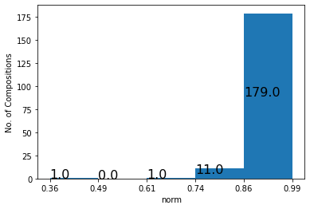

[TOC]

# 3. Lexical and Literary Vocabularies

In the Old Babylonian period (around 1,800 BCE) scribal students learned how to read and write by copying longs lists of signs and words (lexical lists). In a second stage they would start copying a broad variety of Sumerian literary texts, including hymns to gods and kings, narrative texts about gods and heroes of the past, and whimsical texts in which non-human entities (such as hoe and plow) dispute their utility for mankind.

Sumerian by this time was a dead language and the whole curriculum has been interpreted as an "invented tradition" - a golden age, projected in the distant past, when all of Babylonia was united under a single king, speaking a single language - Sumerian[^1].

The sequence lexical exercises - literary exercises may suggest that the literary material embodies the real goal of this education and that the lexical texts, enumerating thousands of Sumerian words and expressions, function in support of the students' ability to read, copy, and understand the literary compositions. Yet, it has often been noticed that many words and expressions in the lexical repertoire never appear in literary texts - and the other way around. In the [list of domestic animals](http://oracc.org/dcclt/Q000001), for instance, we find the entry **udu gug-ga-na₂** (sheep for a *guqqanû* offering; line 98). The expression is known from administrative texts in the Ur III period, several centuries earlier (see, for instance, [TLB 03, 095](http://oracc.org/epsd2/admin/u3adm/P134236) o 9), but in the literary corpus the word **gug-ga-na₂** is absent. Many other such examples could be quoted here.

One may draw the conclusion that the "invented tradition" that was the subject of this curriculum not only involved the literary corpus, but also the Sumerian language itself. The lexical corpus not only functioned in support of the literary corpus - it also had a function of its own in preserving as much as possible of Sumerian writing and vocabulary.

Research on bird vocabulary showed that of the 116 entries in the Old Babylonian [list of birds](http://oracc.org/dcclt/Q000041.405), only 39 can be found in the literary corpus.[^2] This research was mainly done by hand, based on the author's reconstruction of the Old Babylonian bird list and a survey of Sumerian literature - primarily the compositions editied in the Electronic Text Corpus of Sumerian Literature ([ETCSL][]; more on [ETCSL][] below). The challenge of this chapter is: can we scale this analysis up, to include the entire Old Babylonian lexical and literary corpus by using computational methods? And is it possible to use such methods to dig deeper into the relationship between these two vocabularies?

## 3.1 A First Attempt

As a first attempt, we may simply take all Old Babylonian lexical lists from [DCCLT][], extract the full vocabulary and compare that vocabulary to the inventory of words (lemmas) in Sumerian literary texts. The corpus of Sumerian literary texts that we will use is formed by the material currently in [epsd2/literary][]. This includes the compositions edited in [ETCSL][] (excluding the Gudea Cylinders, which were moved to [epsd2/royal](http://oracc.org/epsd2/royal)), the (Sumerian) literary texts published in Ur Excavations Texts Vol. 6/1-3, edited by Jeremiah Peterson, and a somewhat random collection of recently published texts, including most of CUSAS 38.[^3] 

In this approach we are not concerned with word frequencies - the issue simply is: is this particular word (lemma) attested in literary texts (in [epsd2/literary][]), in (Old Babylonian) lexical texts, or in both.

In order to do so we read the  [epsd2/literary][] and the [DCCLT][] datasets into Pandas DataFrames. The first step is to create a field `lemma` by adding Citation Form,  Guide Word, and Part of Speech in the format **du[build]V/t**, or **lugal[king]N**. Next, we restrict the [DCCLT][] dataset to only Old Babylonian documents. We read the `catalogue.json` file from the `dcclt.zip` and isolate the text ID numbers that have the value "Old Babylonian" in the field `period`.  From both datasets we eliminate words that are not in Sumerian (e.g. Akkadian glosses). Finally we extract the new `lemma` field from both datasets and reduce them to their unique elements with the `set()` function: a `set` in Python is an unordered list of unique elements. 

From the two sets, which we call `lit_words_s` and `lexical_words_s` we eliminate all words that have not been lemmatized (unknown words or broken words). We will see in the next section that we will need unlemmatized words in a slightly more sophisticated analysis - but not here. Collections of unique elements can be visualized in a Venn diagram, that shows the two sets as two partly overlapping circles. The intersection of the two sets represents the overlap. This is done with the function `venn2` from the `matplotlib_venn` package, which allows us to select colors and define captions. The result looks like this:


The Old Babylonian lexical corpus currently has more than 4,000 distinct lemmas, of which almost 60% are shared with the literary corpus. The vocabulary of the literary corpus is only slightly larger. The number of items (lemmas) in both sets will change, because of ongoing improvements and additions in both the literary and the lexical corpus. The Venn diagram above is redrawn whenever Notebook 3_1 is run, and this will update the numbers.

For a number of reasons, this is a very rough estimate and perhaps not exactly what we were looking for. A lexical entry like **udu diŋir-e gu₇-a**  (sheep eaten by a god) consists of three very common lemmas (**udu[sheep]N**, **diŋir[deity]N**, **gu[eat]V/t**). This lexical entry, therefore, will result in three matches, three correspondences between the lexical and literary vocabulary. But what about the lexical *entry*? Does the nominal phrase **udu diŋir-e gu₇-a** or, more precisely, the sequence of the lemmas **udu[sheep]N, diŋir[deity]N, gu[eat]V/t**) ever appear in a literary text? 

## 	3.1.2 Lexical Entries in Literary Context

In order to perform the comparison of lexical and literary vocabularies on the lexical *entry* level we first need to represent the data (lexical and literary) as lines, rather than as individual words. The line in a lexical text will become our unit of comparison by defining those as Multiple Word Expressions (or MWEs). Lines in literary texts will serve as boundaries, since we do not expect an MWE to continue from one line to the next. 

The first step, therefore, is to group the data by line. This is done with the Pandas functions `groupby()`and `aggregate()` (abbreviated as `agg()`) . Once the lexical data are grouped by line the lexical dataframe will look like this (from the Old Babylonian [list of animals](http://oracc.org/dcclt/Q000001)):

| id_text       | id_line | lemma                                     |
| :------------ | :------ | :---------------------------------------- |
| dcclt/Q000001 | 1       | udu\[sheep\]N niga\[fattened\]V/i             |
| dcclt/Q000001 | 2       | udu\[sheep\]N niga\[fattened\]V/i sag\[rare\]V/i |

We can use this data to look through the literary compositions to see whether there are places where the lemma **udu[sheep]N** is followed by the lemma **niga[fattened]V/i**, or whether we can find the sequence **udu[sheep]N niga[fattened]V/i sag[rare]V/i**, corresponding to the second line in the list of animals. When such a match is found in a literary composition, the lemmas are connected to each other with underscores, so that the sequence can be treated as a unit. Finding and marking such sequences is done with the MWETokenizer from the Natural Language Toolkit (NLTK) package. The MWETokenizer is initialized with a list of Multiple Word Expressions, which we can easily derive from the lexical data. It then applies this list to the corpus to be tokenized (in this case the [epsd2/literary][] corpus) to connect elements of MWEs by underscores.

Once this is done the lexical entries are treated the same: each space is replaced by an underscore. Now we have the same two sets of data in a slightly different representation and we can do essentially the same analysis as we did above by creating sets (called `lit_words_s2` and `lexical_words_s2`) and then visualize those sets in a Venn diagram: 


We see that this approach essentially doubles the number of unique elements on the lexical side; on the literary side the increase is much less drastic. It turns out that many of the lexical entries (more than 65%) never appear as such in the literary corpus.

## 3.1.3. Add them Up

Finally we can add the two approaches discussed above into a single Venn diagram. There are words that appear as modifiers in lexical *entries* but never appear on their own in a lexical composition. Similarly, there are words in the literary corpus that occur in phrases known from the lexical corpus, but never outside of such phrases (we will see examples below). Such words, one may argue, potentially add to the intersection between the lexical and literary corpus, but are not represented in the second Venn diagram.

In order to do so we create the *union* of the first lexical set (individual words) and the second one (lexical expressions), and the same for the literary corpus and then draw a new Venn diagram. The union of two sets is a new set, with all the unique elements from the two original sets. The union sets are called `lit_words_s3` and `lexical_words_s3`.


The new diagram shows some increase on both sides, and a little increase in overlap as well - but the change is not very dramatic.

So which words are found on the literary side that only appear in MWEs known from lexical sources? We can easily find those by subtracting `lit_words_s2` from `lit_words_s3`. It turns out there are about thirty such words, most of them appearing just once

```
{'ašrinna[object]n',
 'ašša[perfect]aj',
 'babbardili[~stone]n',
 'bur[grass]n',
 'burgia[offering]n',
 'du[hold]v/t',
 'ebir[vessel-stand]n',
 'giʾiziʾešta[~bread]n',
 'gub[bathe]v/i',
 'hub[cvve]v/t',
 'huldim[rotten]aj',
 'kašu[~plow]n',
 'kiŋ[pointed]v/i',
 'ligidba[plant]n',
 'manzila[foot]n',
 'maʾu[barge]n',
 'mud[rabid]aj',
 'nir[trust]n',
 'nisaba[1]dn',
 'niŋkalaga[strong]aj',
 'sa.ku[arm]n',
 'sar[shave]v/t',
 'saŋa[priest]n',
 'tuhul[hip]n',
 'tutu[cvve]v/t',
 'ugudili[scalp]n',
 'uzudirig[mushroom]n',
 'zaga[part-of-the-face]n',
 'zana[doll]n',
 'zidsig[flour]n',
 'še[cone]n'}
```

The word `ašrinna[object]n`, for instance, appears only a few times in the current literary corpus, in one of the Eduba dialogues and in proverbs. In each case the word is preceded by `kid[mat]n` and this word sequence is also found in [Old Babylonian Nippur Ura 2](http://oracc.org/dcclt/Q000040), line 20. As a result, the lemma sequence `kid[mat]n_ašrinna[object]n` was treated as a unit, a Multiple Word Expression, and the separate word `ašrinna[object]n` was not found in `lit_words_s2`.

Our investigation so far has shown that a very considerable portion of lexical words and lexical expressions are not found in the literary corpus as represented by [epsd2/literary][]. Chances are that a good number of them will be found in literary texts that are currently not in [epsd2/literary][] or that are not even known today. However, the lexical corpus is likely to increase, too, and chances that the intersection between those two vocabularies will increase significantly seem slim. 

## 3.2 Overlap in Lexical and Literary Vocabulary: Digging Deeper

In order to research the relationship between lexical and literary material in more detail, we will look at individual literary texts. Which compositions have more and which have less overlap with the lexical vocabulary?

Longer texts will have more vocabulary items (and Multiple Word Expressions) in common with the lexical corpus than shorter texts, but that does not mean much. For that reason we will look at measures of *lexical richness* and ask: are compositions that use a richer lexicon more likely to utilize lemmas found in the lexical corpus than composition with a lower lexical richness rank? 

This line of research has a pedigree that goes back to an article by M. Civil entitled: "Feeding Dumuzi's Sheep: the Lexicon as a Source of Literary Inspiration" (in *Language, Literature, and History: Philological and Historical Studies presented to Erica Reiner*, F. Rochberg, Ed. American Oriental Society, 1987.) In this article, Civil argued that various Sumerian literary texts use enumeration, listing words from a particular semantic field, often with explanatory or interpretative notes. Compositions that include such sections are [*Nanše and the Birds*](http://etcsl.orinst.ox.ac.uk/cgi-bin/etcsl.cgi?text=c.4.14.3&display=Crit&charenc=gcirc#) (bird names), [*Home of the Fish*](http://etcsl.orinst.ox.ac.uk/cgi-bin/etcsl.cgi?text=c.5.9.1&display=Crit&charenc=gcirc#) (fish names), [*Dumuzid Inana W*](http://etcsl.orinst.ox.ac.uk/cgi-bin/etcsl.cgi?text=c.4.08.23&display=Crit&charenc=gcirc#) (plant names; this is the text edited by Civil in his 1987 article), *Ninurta's Fields* (field names), [*Išme-Dagan and Enlil's Chariot*](http://etcsl.orinst.ox.ac.uk/cgi-bin/etcsl.cgi?text=c.2.5.4.09&display=Crit&charenc=gcirc#) (names of chariot parts), *Lipit Eštar and the Plow* (names of parts of a plow), [*Šulgi R*](http://etcsl.orinst.ox.ac.uk/cgi-bin/etcsl.cgi?text=c.2.4.2.18&display=Crit&charenc=gcirc#) (boat parts), and [*Ninurta's Exploits*](http://etcsl.orinst.ox.ac.uk/cgi-bin/etcsl.cgi?text=c.1.6.2&display=Crit&charenc=gcirc#) (stone names). Each of the examples listed above addresses an area of the lexicon (birds, fish, field names, etc.) to which (part of) a lexical composition is specifically dedicated. Whether, in such cases, the source of literary inspiration was the Sumerian lexicon at large, or, more specifically, the particular lexical composition listing such names remains to be seen in each particular case. 

For our purposes, the approach will be somewhat more generalized. The vocabulary items that will be compared between the lexical and literary corpus are not restricted to one semantic field, but will include verbs, Noun - Verb expressions, and any other type of lexeme (or Multiple Word Expression) that we may encounter.

In order to address these questions we will use a Document Term Matrix (DTM): a huge matrix, where each row represents a literary composition (Document) and each column represents a lemma (Term).

In order to do so we will use the Pandas  `groupby()` and `aggregate()` commands again to represent each composition (lexical or literary) as one long string of lemmas.  We will use the data representation where lemmas in Multiple Word Expressions are connected by underscores, so that each MWE is treated as a unit.

Once we have the data represented this way we can use `Countvecorizer()` from the `sklearn` package to create the DTM. The `Countvectorizer()` essentially vectorizes a document by counting the number of times each word appears. In an artificial example we can vectorize the sentences (documents)

> lugal[king]N e[house]N du[build]V/t 
>
> lugal[king]N egal[palace]N du[build]V/t 

as follows: 

| sentence | du[build]V/t | e[house]N | egal[palace]N | lugal[king]N |
| -------- | --------- | -------- | ------------ | ----------- |
| one      | 1         | 1        | 0            | 1           |
| two      | 1         | 0        | 1            | 1           |

We can now say that sentence one is represented by the vector `[1, 1, 0, 1]` and sentence two by the vector `[1, 0, 1, 1]`. That means that we can apply vector operations and vector mathematics on these two sentences - for instance we can compute their cosine similarity (0.66). In real-world examples many slots in the matrix are 0 (there are many words in the corpus that do not appear in this particular document) and many slots are higher than 1 (a word that appears in a document is likely to appear more than once). Note that each *word* (or lemma) is now also characterized by a vector, represented by the numbers in a column.

There are various types of DTMs to investigate in more complex ways the relationships between the lexical and the literary vocabulary. Instead of a full DTM, in which all occurrences of all words are represented, we will first build a *binary* DTM of the literary corpus (the [epsd2/literary][] corpus), using the lexical vocabulary. Our DTM will have one row for each *literary* composition (document) and one column for each lemma or expression attested in the Old Babylonian *lexical* corpus. Because this is a *binary* DTM, each cell has either 0 or 1, to indicate that the word/expression in question does or does not appear in that particular literary composition. How many times a lemma is attested in the composition is not indicated - only *whether* it appears.

Because each column represents a word in the lexical corpus, there are many columns that have only zeros (lexical entries that do not occur in [epsd2/literary][]). In terms of the Venn diagrams discussed above, the zeros in our DTM represent the blue area to the right, the ones represent the middle area (intersection of the lexical and literary vocabulary); the yellow area (words in [epsd2/literary][] that do not appear in the Old Babylonian lexical corpus) is not represented in this DTM. 


The main difference between the Venn diagram and the DTM is that the DTM shows in which compositions the shared words are attested. By computing the sum of a row we get an integer that represents the number of lexically attested lemmas in a particular composition, and this gives us a (numerical) measure for comparing between compositions. Not surprisingly, a longer composition, such as [Ninurta's Exploits](http://etcsl.orinst.ox.ac.uk/cgi-bin/etcsl.cgi?text=c.1.6.2&display=Crit&charenc=gcirc#) (726 lines) has more such matches than shorter ones. In fact, the very short ones (some consist of only a few words) are not very useful for the comparison - we will restrict the analysis to texts that are at least 200 words (lemmas/expressions) long. We will use a normalized measure `norm`, that is defined as the number of matches divided by the number of unique lemmas in the composition. In addition to number of matches, text length,  lexical variation (the number of  unique lemmas) and `norm` we will compute the type-token-ration (TTR), which is defined as the number of unique lemmas (types) divided by the length of the text (number of tokens).  TTR has a strong negative correlation with text length, but for compositions of approximately even length it may give some idea of the creativity vs. repetitiveness of the text. Finally we include a measure called MTLD or *Measure of Textual Lexical Diversity* which, in short, represents the mean number of words (tokens) that are needed to bring the Type Token Ration of a text down from 1 to a threshold value (usually set to 0.720).[^4] The way MTLD works is as follows. A text is read sequentially, starting at word 1. At each step the next word is added and the TTR value of the sequence is computed. When the TTR gets below the threshold value a new sequence is started. This way a text is cut into sections (called factors), each with approximately the same TTR. The mean number of words per factor is a measure of lexical diversity that is not dependent on text length. 

> It should be noted that the threshold value of 0.720 has been established empirically by analyzing texts in English, with the observation that TTR drops dramatically with the first few words (or as soon as a repeated word is encountered), but then levels out to a plateau where additional words have little impact. There is reason to assume that (literary) Sumerian may well need a different threshold value because a) literary Sumerian has very few function words (a major source of repetition in English) and b) unlike English, literary Sumerian tends to repeat phrases or entire paragraphs. The first issue might indicate the necessity of a higher threshold value for Sumerian (because there are few function words, the plateau in the drop of the TTR value should occur at a higher level), the second issue might argue for a lower threshold. More research is needed to establish the validity of this measure and/or the necessity of a different threshold value for literary Sumerian.

The table below gives the first ten compositions, sorted by `norm` (descending). Of the 97 unique lemmas that are attested in [Inana E](http://etcsl.orinst.ox.ac.uk/cgi-bin/etcsl.cgi?text=c.4.07.5&display=Crit&charenc=gcirc#) no less than 95 are also attested in the Old Babylonian lexical corpus - a `norm` score of 0.979.

| id_text                                           | designation                                                            |   length |   mtld |   ttr |   lex_var |   n_matches |   norm |
|---------------------------------------------------|------------------------------------------------------------------------|----------|--------|-------|-----------|-------------|--------|
| [Q000626](http://oracc.org/epsd2/literaryQ000626) | A tigi to Inana (Inana E)                                              |      294 | 24.177 | 0.33  |        97 |          95 |  0.979 |
| [Q000695](http://oracc.org/epsd2/literaryQ000695) | A tigi to Nergal (Nergal C)                                            |      213 | 60.664 | 0.455 |        97 |          95 |  0.979 |
| [P346203](http://oracc.org/epsd2/literaryP346203) | ETCSL 2.05.04.23 Ishme-Dagan W (witness)                               |      215 | 84.494 | 0.581 |       125 |         121 |  0.968 |
| [Q000818](http://oracc.org/epsd2/literaryQ000818) | Proverbs: collection 26                                                |      242 | 99.13  | 0.645 |       156 |         151 |  0.968 |
| [Q000785](http://oracc.org/epsd2/literaryQ000785) | The three ox-drivers from Adab                                         |      268 | 21.743 | 0.34  |        91 |          88 |  0.967 |
| [Q000756](http://oracc.org/epsd2/literaryQ000756) | The advice of a supervisor to a younger scribe (Edubba C)              |      404 | 95.519 | 0.522 |       211 |         203 |  0.962 |
| [Q000494](http://oracc.org/epsd2/literaryQ000494) | An adab to An for Ur-Ninurta (Ur-Ninurta E)                            |      215 | 66.458 | 0.609 |       131 |         126 |  0.962 |
| [Q000384](http://oracc.org/epsd2/literaryQ000384) | An adab to Bau for Luma (Luma A)                                       |      232 | 20.212 | 0.336 |        78 |          75 |  0.962 |
| [Q000433](http://oracc.org/epsd2/literaryQ000433) | A šir-namgala to Mešlamta-ea and Lugal-era for Ibbi-Suen (Ibbi-Suen B) |      285 | 52.473 | 0.435 |       124 |         119 |  0.96  |
| [Q000361](http://oracc.org/epsd2/literaryQ000361) | Gilgameš and Aga                                                       |      471 | 39.397 | 0.363 |       171 |         164 |  0.959 |

> Note that changes in the [epsd2/literary][] and [DCCLT][] data may change the numbers and the arrangement of the table.

In the notebook one may manipulate the table to sort it by different columns (ascending or descending) or by displaying a larger or smaller number of rows. Looking at maximum, minimum, median, and mean of the `norm` variable may give us some idea of how the numbers are distributed.

```
count    203.000000
mean       0.906160
std        0.053349
min        0.359833
25%        0.895003
50%        0.913462
75%        0.930233
max        0.979381
Name: norm, dtype: float64
```

The 25%, 50%, and 75% point are all very close to each other - the great majority of values are on the (very) high side of the scale, with only a few outliers at the bottom. A histogram of the values visualizes that: 



Looking at the bottom of the table we find that the compositions ranking lowest on `norm` are the following

| id_text                                           | designation                                                          |   length |   mtld |   ttr |   lex_var |   n_matches |   norm |
|---------------------------------------------------|----------------------------------------------------------------------|----------|--------|-------|-----------|-------------|--------|
| [Q000371](http://oracc.org/epsd2/literaryQ000371) | The Sumerian king list                                               |     1049 | 10.894 | 0.228 |       239 |          86 |  0.36  |
| [Q000372](http://oracc.org/epsd2/literaryQ000372) | The rulers of Lagaš                                                  |      405 | 25.858 | 0.442 |       179 |         129 |  0.721 |
| [Q000559](http://oracc.org/epsd2/literaryQ000559) | Letter from Puzur-Šulgi to Ibbi-Suen about Išbi-Erra's claim on Isin |      205 | 46.402 | 0.532 |       109 |          82 |  0.752 |
| [Q000752](http://oracc.org/epsd2/literaryQ000752) | A hymn to the E-kur                                                  |      244 | 10.425 | 0.25  |        61 |          46 |  0.754 |
| [Q000632](http://oracc.org/epsd2/literaryQ000632) | A balbale to Inana (Dumuzid-Inana A)                                 |      212 | 10.758 | 0.278 |        59 |          48 |  0.814 |
| [Q000750](http://oracc.org/epsd2/literaryQ000750) | The temple hymns                                                     |     2498 | 86.439 | 0.279 |       697 |         570 |  0.818 |
| [Q000336](http://oracc.org/epsd2/literaryQ000336) | Enlil and Ninlil                                                     |      678 | 20.441 | 0.248 |       168 |         139 |  0.827 |
| [Q000380](http://oracc.org/epsd2/literaryQ000380) | The lament for Sumer and Ur                                          |     2668 | 57.63  | 0.274 |       731 |         616 |  0.843 |
| [Q000379](http://oracc.org/epsd2/literaryQ000379) | The lament for Ur                                                    |     2284 | 23.547 | 0.229 |       524 |         444 |  0.847 |
| [Q000651](http://oracc.org/epsd2/literaryQ000651) | A kungar to Inana (Dumuzid-Inana T)                                  |      236 | 16.243 | 0.479 |       113 |          96 |  0.85  |

[*The Sumerian King List*](http://etcsl.orinst.ox.ac.uk/cgi-bin/etcsl.cgi?text=c.2.1.1&display=Crit&charenc=gcirc#) is the outlier with only 86 matches on 339 unique lemmas and a `norm` score of 0.36. [*The Sumerian King List*](http://etcsl.orinst.ox.ac.uk/cgi-bin/etcsl.cgi?text=c.2.1.1&display=Crit&charenc=gcirc#) is a rather repetitive composition (note its low `mtld`score) that enumerates the names of kings and names of cities, recording regnal years with, occasionally, a brief anecdote about one of those kings. Proper nouns, including royal names and city names, are currently underrepresented in the (lemmatized) lexical corpus. The proper Nnouns in [*The Sumerian King List*](http://etcsl.orinst.ox.ac.uk/cgi-bin/etcsl.cgi?text=c.2.1.1&display=Crit&charenc=gcirc#) explain the large number of lemmas not attested in [DCCLT][]. The next composition ([*The Rulers of Lagaš*](http://etcsl.orinst.ox.ac.uk/cgi-bin/etcsl.cgi?text=c.2.1.2&display=Crit&charenc=gcirc#)) has a `norm`score that is significantly higher (note that the second bin in the histogram is empty), but still low comparatively speaking. [*The Rulers of Lagaš*](http://etcsl.orinst.ox.ac.uk/cgi-bin/etcsl.cgi?text=c.2.1.2&display=Crit&charenc=gcirc#) is moulded on the pattern of the [*The Sumerian King List*](http://etcsl.orinst.ox.ac.uk/cgi-bin/etcsl.cgi?text=c.2.1.1&display=Crit&charenc=gcirc#) and equally features a relatively large number of of proper nouns.

After these two lowest scoring texts, the rest of the [epsd2/literary][] corpus scores at least 0.75, with a median value of 0.913 and a mean of 0.906. In the great majority of cases more than ninety percent of the words and expressions in a literary composition are represented in the lexical corpus. Some of the non-overlap between the two corpora, moreover, may be explained by Proper Nouns, or the use of Emesal (which is very rare in the lexical corpus).

This yields a picture that is very different from the Venn diagrams in section 3.1, where we looked at the intersection of the full vocabulary of [epsd2/literary][] against the full vocabulary of (lemmatized) Old Babylonian lexical texts in [DCCLT][]. The Venn diagram showed that only between 55 and 65% (depending on how we count) of the [epsd2/literary][] vocabulary is found in [DCCLT][], but looking in more detail we realize that the relationship between literary compositions and the contemporary lexical corpus is much tighter and that each composition by itself, on avarage, shares 90% of its vocabulary with the lexical corpus. 

How is it possible to arrive at such different percentages, using the same data set? It means that for any particular composition a good deal of the 90% of vocabulary items that is shared with the lexical corpus is also shared with at least some other compositions, whereas the 10% of items not shared may well be unique to that composition.

# Note
> What follows should bear out the hypothesis that the intersection of lex/lit contains (on average) the more common lexical items. It should also include a concrete example of a literary text with the shared and non-shared vocabulary. Finally, it should include a discussion of Emesal, its role in literature and its place in the lexical tradition.

> The following section needs to be re-written, probably using a different example, after processing P-Izi and Bilingual Nigga.

To make this more concrete we may look at the vocabulary of Dumuzid's Dream ([c.1.4.3](http://etcsl.orinst.ox.ac.uk/cgi-bin/etcsl.cgi?text=c.1.4.3&display=Crit&charenc=gcirc#)). The text has a length of 1162 tokens, with 278 distinct lemmas. Of these lemmas 245 (88.1%) match with lemmas in Old Babylonian lexical texts - a norm score very close to the mean (0.878). The non-matching lemmas are the following:

```
{'10[10]',
 '1[1]',
 '2-kam-ma[2nd]',
 '2[2]',
 '3-kam-ma[3rd]',
 '4-kam-ma[4th]',
 '5-kam-ma[5th]',
 '5[5]',
 '6-kam-ma[6th]',
 '7-kam-ma[7th]',
 'amaŋeštinanak[1]',
 'arali[1]',
 'banda[child]',
 'belili[1]',
 'de[bring]',
 'dubban[fence]',
 'durtur[1]',
 'enedi[game]',
 'girid[unmng]',
 'ilu[song]',
 'kubireš[1]',
 'kubirešdildareš[1]',
 'mašuzudak[goat]',
 'nadeg[advice]',
 'ne[cvne]',
 'nim.ah+me.da[unmng]',
 'tun₃[cover?]',
 'uduʾutuwa[ram]',
 'zipatum[cord]',
 'ŋeštindudu[1]',
 'šarag[dry]',
 'širkalkal[subscript]',
 'šudu[handcuffs]'}
```

This list (n = 33) contains some of the word types discussed above: number words (10), and proper nouns (geographical names and god names, together 7). The list also includes fairly common nouns, such as **ilu[song]N**, which is lemmatized as **ilu[lament]N** in [DCCLT][], or **banda[child]N**, which is **banda[junior]N** in [DCCLT][]. The word **dubban[fence]N** is found in [DCCLT][], but not (so far) in Old Babylonian exemplars. Thus 33 lemmas in Dumuzid's Dream that do not match anything in Old Babylonian lexical texts partly come from incompatible lemmatizations, and only in a minority of cases do they represent words that are truly not attested in the Old Babylonian lexical corpus - such as **dubban[fence]** or  **zipatum[cord]**.


=============================================

Moreover, the `norm` scale does not clearly separate between literary compositions known to be used at school, and compositions that may come from a different (perhaps liturgical) background. 

Ordering by text *length* we see that the Gudea cylinders are by far the longest composition in this group at 4,387 lemmas. The next composition is Ninurta's exploits (or Lugal-e) at 3,160, followed by The Lament for Sumer and Ur (2,701). From there on compositions gradually get shorter, but the first two stand out. 

As expected, text length correlates negatively with TTR, as can be illustrated with the following graph


The graph clearly shows the trend, associating a lower TTR with longer texts. It also shows by how much the Gudea Cylinders: (lower right dot; [c.2.1.7](http://etcsl.orinst.ox.ac.uk/cgi-bin/etcsl.cgi?text=c.2.1.7&display=Crit&charenc=gcirc#)) fall outside of the range of regular Old Babylonian literary texts in terms of text length. The highest dot (TTR 0.705) is *Sin-iddinam E* ([c.2.6.6.5](http://etcsl.orinst.ox.ac.uk/cgi-bin/etcsl.cgi?text=c.2.6.6.5&display=Crit&charenc=gcirc#)), which is also one of the shortest text in this graph at 207 lemmas (we set minimum text length at 200). If we draw an imaginary curve from the upper left to the lower right we can see that there are plenty of compositions that are positioned well under that curve, but that there are no outliers in the upper right half of the graph. In other words, there are (plenty of) texts that repeat vocabulary more than expected from their length - but there are few texts that go at great length to use as many different lemmas as one can think of.

Finally, the graph shows that the Gudea Cylinders ([c.2.1.7](http://etcsl.orinst.ox.ac.uk/cgi-bin/etcsl.cgi?text=c.2.1.7&display=Crit&charenc=gcirc#)), even though by far the longest composition, is not the one with the lowest TTR. In fact, there are four compositions that are (much) shorter, but have an even lower TTR. These are: 

| id_text                                                      | text_name                            | length | ttr   |
| ------------------------------------------------------------ | ------------------------------------ | ------ | ----- |
| [c.1.3.1](http://etcsl.orinst.ox.ac.uk/cgi-bin/etcsl.cgi?text=c.1.3.1&display=Crit&charenc=gcirc#) | Inana and Enki                       | 2085   | 0167  |
| [c.1.5.1](http://etcsl.orinst.ox.ac.uk/cgi-bin/etcsl.cgi?text=c.1.5.1&display=Crit&charenc=gcirc#) | Nanna-Suen's journey to Nibru        | 1219   | 0.187 |
| [c.1.8.1.4](http://etcsl.orinst.ox.ac.uk/cgi-bin/etcsl.cgi?text=c.1.8.1.4&display=Crit&charenc=gcirc#) | Gilgameš Enkidu and the nether world | 2145   | 0.191 |
| [c.1.4.1](http://etcsl.orinst.ox.ac.uk/cgi-bin/etcsl.cgi?text=c.1.4.1&display=Crit&charenc=gcirc#) | Inana's descent to the nether world  | 1827   | 0.205 |
| [c.2.1.7](http://etcsl.orinst.ox.ac.uk/cgi-bin/etcsl.cgi?text=c.2.1.7&display=Crit&charenc=gcirc#) | Gudea Cylinders A and B              | 4387   | 0.209 |

Each of these compositions is characterized by the wholesale repetition of passages. For instance, *Inana and Enki* ([c.1.3.1](http://etcsl.orinst.ox.ac.uk/cgi-bin/etcsl.cgi?text=c.1.3.1&display=Crit&charenc=gcirc#)), is a story about how the goddess Inana tricks the god Enki to give her a long list of *ME*s or divine essences. The list of *ME*s includes things like wisdom, and purification rites, but also deceit, plundering of cities, and strife. The whole list is repeated, verbatim, at several places in the composition - surely going a long way to explain the very low TTR.

As explained above, the use of MTLD in this context is experimental and provisional at best. The following table displays the ten highest scoring compositions: 

| id_text                                                      | text_name                                                    | length | mtld    | ttr   | lex_var | n_matches | norm  |
| ------------------------------------------------------------ | ------------------------------------------------------------ | ------ | ------- | ----- | ------- | --------- | ----- |
| [c.2.5.8.1](http://etcsl.orinst.ox.ac.uk/cgi-bin/etcsl.cgi?text=c.2.5.8.1&display=Crit&charenc=gcirc#) | A praise poem of Enlil-bāni (Enlil-bāni A)                   | 316    | 239.19  | 0.68  | 215     | 197       | 0.916 |
| [c.2.5.4.09](http://etcsl.orinst.ox.ac.uk/cgi-bin/etcsl.cgi?text=c.2.5.4.09&display=Crit&charenc=gcirc#) | Išme-Dagan and Enlil's chariot: a tigi to Enlil (Išme-Dagan I) | 265    | 214.218 | 0.687 | 182     | 165       | 0.907 |
| [c.2.5.5.1](http://etcsl.orinst.ox.ac.uk/cgi-bin/etcsl.cgi?text=c.2.5.5.1&display=Crit&charenc=gcirc#) | A praise poem of Lipit-Eštar (Lipit-Eštar A)                 | 392    | 184.526 | 0.612 | 240     | 218       | 0.908 |
| [c.6.1.04](http://etcsl.orinst.ox.ac.uk/cgi-bin/etcsl.cgi?text=c.6.1.04&display=Crit&charenc=gcirc#) | Proverbs: collection 4                                       | 252    | 174.198 | 0.687 | 173     | 148       | 0.855 |
| [c.2.4.1.3](http://etcsl.orinst.ox.ac.uk/cgi-bin/etcsl.cgi?text=c.2.4.1.3&display=Crit&charenc=gcirc#) | A praise poem of Ur-Namma (Ur-Namma C)                       | 478    | 169.821 | 0.529 | 253     | 223       | 0.881 |
| [c.2.4.2.18](http://etcsl.orinst.ox.ac.uk/cgi-bin/etcsl.cgi?text=c.2.4.2.18&display=Crit&charenc=gcirc#) | Šulgi and Ninlil's barge: a tigi (?) to Ninlil  (Šulgi R)    | 471    | 168.391 | 0.554 | 261     | 221       | 0.847 |
| [c.2.4.2.01](http://etcsl.orinst.ox.ac.uk/cgi-bin/etcsl.cgi?text=c.2.4.2.01&display=Crit&charenc=gcirc#) | A praise poem of Šulgi (Šulgi A)                             | 471    | 163.841 | 0.586 | 276     | 250       | 0.906 |
| [c.2.5.6.2](http://etcsl.orinst.ox.ac.uk/cgi-bin/etcsl.cgi?text=c.2.5.6.2&display=Crit&charenc=gcirc#) | A tigi to Enki for Ur-Ninurta (Ur-Ninurta B)                 | 278    | 162.146 | 0.622 | 173     | 157       | 0.908 |
| [c.1.2.2](http://etcsl.orinst.ox.ac.uk/cgi-bin/etcsl.cgi?text=c.1.2.2&display=Crit&charenc=gcirc#) | Enlil and Sud                                                | 987    | 158.681 | 0.387 | 382     | 331       | 0.866 |
| [c.2.6.6.5](http://etcsl.orinst.ox.ac.uk/cgi-bin/etcsl.cgi?text=c.2.6.6.5&display=Crit&charenc=gcirc#) | Sîn-iddinam and Iškur (Sîn-iddinam E)                        | 207    | 155.25  | 0.705 | 146     | 130       | 0.89  |

The highest score is 239.19 for Enlil-bani A ([c.2.5.8.1](http://etcsl.orinst.ox.ac.uk/cgi-bin/etcsl.cgi?text=c.2.5.8.1&display=Crit&charenc=gcirc#)]). This is a very high score, in particular because the composition is only 316 lemmas long. Text length and MTLD are not correlated in a significant way, but in this case it means that the Enlil-bani poem has only one full factor plus a partial factor, so the mean of those factors can hardly be computed in a reliable way. Still, it indicates that the composition uses very little repetition (215 unique items on 316 lemmas). 

On the lower end of the MTLD score we find the following compositions: 

| id_text                                                      | text_name                                     | length | mtld   | ttr   | lex_var | n_matches | norm  |
| ------------------------------------------------------------ | --------------------------------------------- | ------ | ------ | ----- | ------- | --------- | ----- |
| [c.1.4.1.3](http://etcsl.orinst.ox.ac.uk/cgi-bin/etcsl.cgi?text=c.1.4.1.3&display=Crit&charenc=gcirc#) | Dumuzid and his sisters                       | 276    | 9.435  | 0.373 | 103     | 89        | 0.864 |
| [c.4.08.18](http://etcsl.orinst.ox.ac.uk/cgi-bin/etcsl.cgi?text=c.4.08.18&display=Crit&charenc=gcirc#) | A song of Inana and Dumuzid (Dumuzid-Inana R) | 248    | 9.842  | 0.323 | 80      | 69        | 0.862 |
| [c.4.80.4](http://etcsl.orinst.ox.ac.uk/cgi-bin/etcsl.cgi?text=c.4.80.4&display=Crit&charenc=gcirc#) | A hymn to the E-kur                           | 244    | 10.425 | 0.25  | 61      | 46        | 0.754 |
| [c.4.08.01](http://etcsl.orinst.ox.ac.uk/cgi-bin/etcsl.cgi?text=c.4.08.01&display=Crit&charenc=gcirc#) | A balbale to Inana (Dumuzid-Inana A)          | 208    | 10.491 | 0.284 | 59      | 47        | 0.797 |
| [c.1.7.3](http://etcsl.orinst.ox.ac.uk/cgi-bin/etcsl.cgi?text=c.1.7.3&display=Crit&charenc=gcirc#) | Ninŋišzida's journey to the nether world      | 476    | 11.732 | 0.342 | 163     | 144       | 0.883 |
| [c.4.07.7](http://etcsl.orinst.ox.ac.uk/cgi-bin/etcsl.cgi?text=c.4.07.7&display=Crit&charenc=gcirc#) | A šir-namšub to Inana (Inana G)               | 297    | 12.571 | 0.428 | 127     | 107       | 0.843 |
| [c.4.08.20](http://etcsl.orinst.ox.ac.uk/cgi-bin/etcsl.cgi?text=c.4.08.20&display=Crit&charenc=gcirc#) | A kunŋar to Inana (Dumuzid-Inana T)           | 242    | 15.35  | 0.455 | 110     | 91        | 0.827 |
| [c.1.1.1](http://etcsl.orinst.ox.ac.uk/cgi-bin/etcsl.cgi?text=c.1.1.1&display=Crit&charenc=gcirc#) | Enki and Ninhursaŋa                           | 1134   | 16.106 | 0.274 | 311     | 251       | 0.807 |
| [c.4.08.33](http://etcsl.orinst.ox.ac.uk/cgi-bin/etcsl.cgi?text=c.4.08.33&display=Crit&charenc=gcirc#) | Dumuzid and Enkimdu                           | 294    | 16.469 | 0.401 | 118     | 105       | 0.89  |
| [c.1.5.1](http://etcsl.orinst.ox.ac.uk/cgi-bin/etcsl.cgi?text=c.1.5.1&display=Crit&charenc=gcirc#) | Nanna-Suen's journey to Nibru                 | 1219   | 16.542 | 0.187 | 228     | 194       | 0.851 |

An inspection of the lowest scoring compositions will show that these tend to repeat lines with small variations, as in:

| Dumuzi and his sisters 23-24                  | [c.6.1.04](http://etcsl.orinst.ox.ac.uk/cgi-bin/etcsl.cgi?text=c.6.1.04&display=Crit&charenc=gcirc#) |
| --------------------------------------------- | ------------------------------------------------------------ |
| šeš-ŋu₁₀ me-a di-di me-e mu-da-ul₄-le-en      | My brother, wherever you go I will hasten with you.          |
| {d}du₅-mu-zid me-a di-di me-e mu-da-ul₄-le-en | Dumuzid, wherever you go I will hasten with you.             |

This is a frequent device in Sumerian poetry. A histogram of the distribution of MTLD values shows that the lowest values (between 9.4 and 86.0) are the most frequent, followed by values up to 162.6, with only 7 outliers with higher MLTD values.


[^1]: 	N. Veldhuis, *Religion, Literature, and Scholarship: The Sumerian Composition "Nanše and the Birds"*. Cuneiform Monographs 22. Leiden: Brill 2004.
[^2]:	N. Veldhuis, *Religion, Literature, and Scholarship: The Sumerian Composition "Nanše and the Birds"*. Cuneiform Monographs 22. Leiden: Brill 2004.
[^3]	C. Metcalf, *Sumerian Literary Texts in the Schøyen Collection: Volume 1: Literary Sources on Old Babylonian Religion*. Cornell University Studies in Assyriology and Sumerology. Winona Lake: Eisenbrauns 2019. 
[^4]: McCarthy, P.M. & Jarvis, S. "MTLD, vocd-D, and HD-D: A validation study of sophisticated approaches to lexical diversity assessment" in: [Behavior Research Methods 42 (2010): 381-392](https://doi.org/10.3758/BRM.42.2.381).
[^5]:	For tetrad, decad and House F Fourteen, see E. Robson, The tablet House: a scribal school in old Babylonian Nippur, in: *Revue d'Assyriologie* 93 (2001) 39-66, [doi:10.3917/assy.093.0039](https://doi.org/10.3917/assy.093.0039); and Paul Delnero, *The Textual Criticism of Sumerian Literature*, Journal of Cuneiform Studies Supplementary Series 3 (2012); both with further literature.

[ETCSL]: http://etcsl.orinst.ox.ac.uk
[DCCLT]: http://oracc.org/dcclt
[epsd2/literary]: http://oracc.org/epsd2/literary
```

```