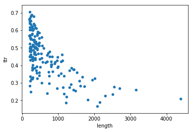
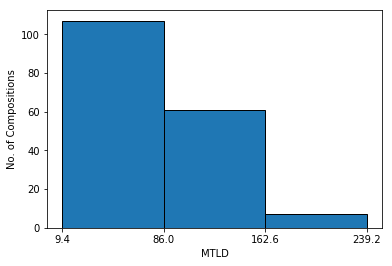

# Note
> What follows should bear out the hypothesis that the intersection of lex/lit contains (on average) the more common lexical items. It should also include a concrete example of a literary text with the shared and non-shared vocabulary. Finally, it should include a discussion of Emesal, its role in literature and its place in the lexical tradition.

> The following section needs to be re-written, probably using a different example, after processing P-Izi and Bilingual Nigga.

To make this more concrete we may look at the vocabulary of Dumuzid's Dream ([c.1.4.3](http://etcsl.orinst.ox.ac.uk/cgi-bin/etcsl.cgi?text=c.1.4.3&display=Crit&charenc=gcirc#)). The text has a length of 1162 tokens, with 278 distinct lemmas. Of these lemmas 245 (88.1%) match with lemmas in Old Babylonian lexical texts - a norm score very close to the mean (0.878). The non-matching lemmas are the following:

```
{'10[10]',
 '1[1]',
 '2-kam-ma[2nd]',
 '2[2]',
 '3-kam-ma[3rd]',
 '4-kam-ma[4th]',
 '5-kam-ma[5th]',
 '5[5]',
 '6-kam-ma[6th]',
 '7-kam-ma[7th]',
 'amaŋeštinanak[1]',
 'arali[1]',
 'banda[child]',
 'belili[1]',
 'de[bring]',
 'dubban[fence]',
 'durtur[1]',
 'enedi[game]',
 'girid[unmng]',
 'ilu[song]',
 'kubireš[1]',
 'kubirešdildareš[1]',
 'mašuzudak[goat]',
 'nadeg[advice]',
 'ne[cvne]',
 'nim.ah+me.da[unmng]',
 'tun₃[cover?]',
 'uduʾutuwa[ram]',
 'zipatum[cord]',
 'ŋeštindudu[1]',
 'šarag[dry]',
 'širkalkal[subscript]',
 'šudu[handcuffs]'}
```

This list (n = 33) contains some of the word types discussed above: number words (10), and proper nouns (geographical names and god names, together 7). The list also includes fairly common nouns, such as **ilu[song]N**, which is lemmatized as **ilu[lament]N** in [DCCLT][], or **banda[child]N**, which is **banda[junior]N** in [DCCLT][]. The word **dubban[fence]N** is found in [DCCLT][], but not (so far) in Old Babylonian exemplars. Thus 33 lemmas in Dumuzid's Dream that do not match anything in Old Babylonian lexical texts partly come from incompatible lemmatizations, and only in a minority of cases do they represent words that are truly not attested in the Old Babylonian lexical corpus - such as **dubban[fence]** or  **zipatum[cord]**.


=============================================

Moreover, the `norm` scale does not clearly separate between literary compositions known to be used at school, and compositions that may come from a different (perhaps liturgical) background. 

Ordering by text *length* we see that the Gudea cylinders are by far the longest composition in this group at 4,387 lemmas. The next composition is Ninurta's exploits (or Lugal-e) at 3,160, followed by The Lament for Sumer and Ur (2,701). From there on compositions gradually get shorter, but the first two stand out. 

As expected, text length correlates negatively with TTR, as can be illustrated with the following graph



The graph clearly shows the trend, associating a lower TTR with longer texts. It also shows by how much the Gudea Cylinders: (lower right dot; [c.2.1.7](http://etcsl.orinst.ox.ac.uk/cgi-bin/etcsl.cgi?text=c.2.1.7&display=Crit&charenc=gcirc#)) fall outside of the range of regular Old Babylonian literary texts in terms of text length. The highest dot (TTR 0.705) is *Sin-iddinam E* ([c.2.6.6.5](http://etcsl.orinst.ox.ac.uk/cgi-bin/etcsl.cgi?text=c.2.6.6.5&display=Crit&charenc=gcirc#)), which is also one of the shortest text in this graph at 207 lemmas (we set minimum text length at 200). If we draw an imaginary curve from the upper left to the lower right we can see that there are plenty of compositions that are positioned well under that curve, but that there are no outliers in the upper right half of the graph. In other words, there are (plenty of) texts that repeat vocabulary more than expected from their length - but there are few texts that go at great length to use as many different lemmas as one can think of.

Finally, the graph shows that the Gudea Cylinders ([c.2.1.7](http://etcsl.orinst.ox.ac.uk/cgi-bin/etcsl.cgi?text=c.2.1.7&display=Crit&charenc=gcirc#)), even though by far the longest composition, is not the one with the lowest TTR. In fact, there are four compositions that are (much) shorter, but have an even lower TTR. These are: 

| id_text                                                      | text_name                            | length | ttr   |
| ------------------------------------------------------------ | ------------------------------------ | ------ | ----- |
| [c.1.3.1](http://etcsl.orinst.ox.ac.uk/cgi-bin/etcsl.cgi?text=c.1.3.1&display=Crit&charenc=gcirc#) | Inana and Enki                       | 2085   | 0167  |
| [c.1.5.1](http://etcsl.orinst.ox.ac.uk/cgi-bin/etcsl.cgi?text=c.1.5.1&display=Crit&charenc=gcirc#) | Nanna-Suen's journey to Nibru        | 1219   | 0.187 |
| [c.1.8.1.4](http://etcsl.orinst.ox.ac.uk/cgi-bin/etcsl.cgi?text=c.1.8.1.4&display=Crit&charenc=gcirc#) | Gilgameš Enkidu and the nether world | 2145   | 0.191 |
| [c.1.4.1](http://etcsl.orinst.ox.ac.uk/cgi-bin/etcsl.cgi?text=c.1.4.1&display=Crit&charenc=gcirc#) | Inana's descent to the nether world  | 1827   | 0.205 |
| [c.2.1.7](http://etcsl.orinst.ox.ac.uk/cgi-bin/etcsl.cgi?text=c.2.1.7&display=Crit&charenc=gcirc#) | Gudea Cylinders A and B              | 4387   | 0.209 |

Each of these compositions is characterized by the wholesale repetition of passages. For instance, *Inana and Enki* ([c.1.3.1](http://etcsl.orinst.ox.ac.uk/cgi-bin/etcsl.cgi?text=c.1.3.1&display=Crit&charenc=gcirc#)), is a story about how the goddess Inana tricks the god Enki to give her a long list of *ME*s or divine essences. The list of *ME*s includes things like wisdom, and purification rites, but also deceit, plundering of cities, and strife. The whole list is repeated, verbatim, at several places in the composition - surely going a long way to explain the very low TTR.

As explained above, the use of MTLD in this context is experimental and provisional at best. The following table displays the ten highest scoring compositions: 

| id_text                                                      | text_name                                                    | length | mtld    | ttr   | lex_var | n_matches | norm  |
| ------------------------------------------------------------ | ------------------------------------------------------------ | ------ | ------- | ----- | ------- | --------- | ----- |
| [c.2.5.8.1](http://etcsl.orinst.ox.ac.uk/cgi-bin/etcsl.cgi?text=c.2.5.8.1&display=Crit&charenc=gcirc#) | A praise poem of Enlil-bāni (Enlil-bāni A)                   | 316    | 239.19  | 0.68  | 215     | 197       | 0.916 |
| [c.2.5.4.09](http://etcsl.orinst.ox.ac.uk/cgi-bin/etcsl.cgi?text=c.2.5.4.09&display=Crit&charenc=gcirc#) | Išme-Dagan and Enlil's chariot: a tigi to Enlil (Išme-Dagan I) | 265    | 214.218 | 0.687 | 182     | 165       | 0.907 |
| [c.2.5.5.1](http://etcsl.orinst.ox.ac.uk/cgi-bin/etcsl.cgi?text=c.2.5.5.1&display=Crit&charenc=gcirc#) | A praise poem of Lipit-Eštar (Lipit-Eštar A)                 | 392    | 184.526 | 0.612 | 240     | 218       | 0.908 |
| [c.6.1.04](http://etcsl.orinst.ox.ac.uk/cgi-bin/etcsl.cgi?text=c.6.1.04&display=Crit&charenc=gcirc#) | Proverbs: collection 4                                       | 252    | 174.198 | 0.687 | 173     | 148       | 0.855 |
| [c.2.4.1.3](http://etcsl.orinst.ox.ac.uk/cgi-bin/etcsl.cgi?text=c.2.4.1.3&display=Crit&charenc=gcirc#) | A praise poem of Ur-Namma (Ur-Namma C)                       | 478    | 169.821 | 0.529 | 253     | 223       | 0.881 |
| [c.2.4.2.18](http://etcsl.orinst.ox.ac.uk/cgi-bin/etcsl.cgi?text=c.2.4.2.18&display=Crit&charenc=gcirc#) | Šulgi and Ninlil's barge: a tigi (?) to Ninlil  (Šulgi R)    | 471    | 168.391 | 0.554 | 261     | 221       | 0.847 |
| [c.2.4.2.01](http://etcsl.orinst.ox.ac.uk/cgi-bin/etcsl.cgi?text=c.2.4.2.01&display=Crit&charenc=gcirc#) | A praise poem of Šulgi (Šulgi A)                             | 471    | 163.841 | 0.586 | 276     | 250       | 0.906 |
| [c.2.5.6.2](http://etcsl.orinst.ox.ac.uk/cgi-bin/etcsl.cgi?text=c.2.5.6.2&display=Crit&charenc=gcirc#) | A tigi to Enki for Ur-Ninurta (Ur-Ninurta B)                 | 278    | 162.146 | 0.622 | 173     | 157       | 0.908 |
| [c.1.2.2](http://etcsl.orinst.ox.ac.uk/cgi-bin/etcsl.cgi?text=c.1.2.2&display=Crit&charenc=gcirc#) | Enlil and Sud                                                | 987    | 158.681 | 0.387 | 382     | 331       | 0.866 |
| [c.2.6.6.5](http://etcsl.orinst.ox.ac.uk/cgi-bin/etcsl.cgi?text=c.2.6.6.5&display=Crit&charenc=gcirc#) | Sîn-iddinam and Iškur (Sîn-iddinam E)                        | 207    | 155.25  | 0.705 | 146     | 130       | 0.89  |

The highest score is 239.19 for Enlil-bani A ([c.2.5.8.1](http://etcsl.orinst.ox.ac.uk/cgi-bin/etcsl.cgi?text=c.2.5.8.1&display=Crit&charenc=gcirc#)]). This is a very high score, in particular because the composition is only 316 lemmas long. Text length and MTLD are not correlated in a significant way, but in this case it means that the Enlil-bani poem has only one full factor plus a partial factor, so the mean of those factors can hardly be computed in a reliable way. Still, it indicates that the composition uses very little repetition (215 unique items on 316 lemmas). 

On the lower end of the MTLD score we find the following compositions: 

| id_text                                                      | text_name                                     | length | mtld   | ttr   | lex_var | n_matches | norm  |
| ------------------------------------------------------------ | --------------------------------------------- | ------ | ------ | ----- | ------- | --------- | ----- |
| [c.1.4.1.3](http://etcsl.orinst.ox.ac.uk/cgi-bin/etcsl.cgi?text=c.1.4.1.3&display=Crit&charenc=gcirc#) | Dumuzid and his sisters                       | 276    | 9.435  | 0.373 | 103     | 89        | 0.864 |
| [c.4.08.18](http://etcsl.orinst.ox.ac.uk/cgi-bin/etcsl.cgi?text=c.4.08.18&display=Crit&charenc=gcirc#) | A song of Inana and Dumuzid (Dumuzid-Inana R) | 248    | 9.842  | 0.323 | 80      | 69        | 0.862 |
| [c.4.80.4](http://etcsl.orinst.ox.ac.uk/cgi-bin/etcsl.cgi?text=c.4.80.4&display=Crit&charenc=gcirc#) | A hymn to the E-kur                           | 244    | 10.425 | 0.25  | 61      | 46        | 0.754 |
| [c.4.08.01](http://etcsl.orinst.ox.ac.uk/cgi-bin/etcsl.cgi?text=c.4.08.01&display=Crit&charenc=gcirc#) | A balbale to Inana (Dumuzid-Inana A)          | 208    | 10.491 | 0.284 | 59      | 47        | 0.797 |
| [c.1.7.3](http://etcsl.orinst.ox.ac.uk/cgi-bin/etcsl.cgi?text=c.1.7.3&display=Crit&charenc=gcirc#) | Ninŋišzida's journey to the nether world      | 476    | 11.732 | 0.342 | 163     | 144       | 0.883 |
| [c.4.07.7](http://etcsl.orinst.ox.ac.uk/cgi-bin/etcsl.cgi?text=c.4.07.7&display=Crit&charenc=gcirc#) | A šir-namšub to Inana (Inana G)               | 297    | 12.571 | 0.428 | 127     | 107       | 0.843 |
| [c.4.08.20](http://etcsl.orinst.ox.ac.uk/cgi-bin/etcsl.cgi?text=c.4.08.20&display=Crit&charenc=gcirc#) | A kunŋar to Inana (Dumuzid-Inana T)           | 242    | 15.35  | 0.455 | 110     | 91        | 0.827 |
| [c.1.1.1](http://etcsl.orinst.ox.ac.uk/cgi-bin/etcsl.cgi?text=c.1.1.1&display=Crit&charenc=gcirc#) | Enki and Ninhursaŋa                           | 1134   | 16.106 | 0.274 | 311     | 251       | 0.807 |
| [c.4.08.33](http://etcsl.orinst.ox.ac.uk/cgi-bin/etcsl.cgi?text=c.4.08.33&display=Crit&charenc=gcirc#) | Dumuzid and Enkimdu                           | 294    | 16.469 | 0.401 | 118     | 105       | 0.89  |
| [c.1.5.1](http://etcsl.orinst.ox.ac.uk/cgi-bin/etcsl.cgi?text=c.1.5.1&display=Crit&charenc=gcirc#) | Nanna-Suen's journey to Nibru                 | 1219   | 16.542 | 0.187 | 228     | 194       | 0.851 |

An inspection of the lowest scoring compositions will show that these tend to repeat lines with small variations, as in:

| Dumuzi and his sisters 23-24                  | [c.6.1.04](http://etcsl.orinst.ox.ac.uk/cgi-bin/etcsl.cgi?text=c.6.1.04&display=Crit&charenc=gcirc#) |
| --------------------------------------------- | ------------------------------------------------------------ |
| šeš-ŋu₁₀ me-a di-di me-e mu-da-ul₄-le-en      | My brother, wherever you go I will hasten with you.          |
| {d}du₅-mu-zid me-a di-di me-e mu-da-ul₄-le-en | Dumuzid, wherever you go I will hasten with you.             |

This is a frequent device in Sumerian poetry. A histogram of the distribution of MTLD values shows that the lowest values (between 9.4 and 86.0) are the most frequent, followed by values up to 162.6, with only 7 outliers with higher MLTD values.

